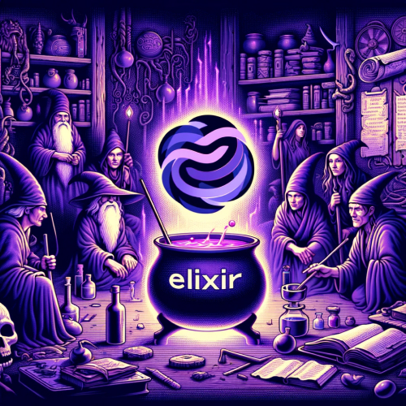

#  Masters of Elixir 

### :label: Labels

:heavy_dollar_sign: Paid :free: Content Free :brazil: pt-BR :us: en :es: es :fr: fr :jp: jp

## Table of Content

:speech_balloon: [Chats](#speech_balloon-chats) - :books: [Courses](#books-courses) - :newspaper: [Newsletters](#newspaper-newsletters) - :book: [Documentation](#book-documentation) - :globe_with_meridians: [Forums](#globe_with_meridians-forums) - :books: [Books](#books-books) - :iphone: [Social Media](#iphone-social-media) - :studio_microphone: [Podcasts](#studio_microphone-podcasts) - :computer: [Programming Challenges](#computer-programming-challenges) - :clapper: [Youtube Channels](#clapper-youtube-channels) - :globe_with_meridians: [Hosting Services](#globe_with_meridians-hosting-services) - :package: [Package Information](#package-package-information) - :tada: [Elixir Community Events](#tada-elixir-community-events)

## :speech_balloon: Chats

#### Telegram

- [Elixir Brazil :brazil:](https://t.me/elixirbr) - Official Elixir group in Brazil.
- [Elixir Brasil offtopic :brazil:](https://t.me/elixirbr_offtopic) - Off-topic discussions about Elixir in Brazil.
- [Elug CE :brazil:](https://t.me/elug_ce) - Elixir user group in Ceará, Brazil.
- [Elixir World :us:](https://t.me/elixir_world) - Global Elixir group.

#### Discord

- [Elixir Official :us:](https://discord.com/invite/elixir) - Official Elixir community on Discord.

#### Slack

## :books: Courses

- [Udemy Elixir Courses :us: :heavy_dollar_sign:](https://www.udemy.com/topic/elixir/) - A collection of various Elixir courses on Udemy.
- [Pragmatic Studio Elixir Course :us: :heavy_dollar_sign:](https://pragmaticstudio.com/elixir) - Learn Elixir through this comprehensive course by Pragmatic Studio.

## :newspaper: Newsletters

- [Elixir Weekly :us:](https://elixirweekly.net/) - Weekly newsletter about Elixir.
- [Elixir Radar :us:](https://elixir-radar.com/) - The latest news and resources about Elixir.
- [Elixir Merge :us:](https://elixirmerge.com/) - Updates and news about Elixir.
- [Data Elixir :us:](https://dataelixir.com/) - Data Science - Newsletter about data science with a focus on Elixir.
- [Awesome Elixir Newsletter :us:](https://elixir.libhunt.com/newsletter) - Amazing resources about Elixir.
- [Café com Elixir :brazil:](https://cafecomelixir.substack.com/) - News and tips about Elixir from Brazil.

## :book: Documentation

- [Elixir 1.16 standard library :us:](https://hexdocs.pm/elixir/1.16.3/Kernel.html) - Documentation for the Elixir 1.16 standard library.

## :globe_with_meridians: Forums

- [Elixir :us:](https://elixirforum.com/) - The official forum for Elixir discussions.
- [Elixir Reddit :us:](https://www.reddit.com/r/elixir/) - Subreddit for discussions, news, and questions about Elixir.

## :books: Books

- [Programming Elixir 1.6, Functional |> Concurrent |> Pragmatic |> Fun, Dave Thomas :us:](https://pragprog.com/titles/elixir16/programming-elixir-1-6/) - Comprehensive book on Elixir by Dave Thomas.
- [Elixir: Do zero à concorrência 🇧🇷](https://www.amazon.com.br/Elixir-Do-zero-%C3%A0-concorr%C3%AAncia-ebook/dp/B06Y5SWJR8/ref=sr_1_1?crid=358KW784GB54W&dib=eyJ2IjoiMSJ9.R16LMJKJOfANS4_gxPj2lLETJXajc6Dfb5BQx0X7vepX9gGS35hn_dmMWRisvgAhZ7Q8Lpmvoo_AUaMIS0bXrSK5X-mqyduam7xm-gecxdPeqAbftydGz0gCyubPaudhCr3czdRHQgOTDdtxktSwh3Zo0dRJHJLj7Gx5j9CvbRYPa5yL2s-fVTe0G9_6OMCGLqZqfEY3sCzGq6DJDapc050pe76d8wL8NFIlXG13Rx5lpXKiUr27u5qtVJaHT7qXVaBxOyze-cgbMDN5JYTZvLcAMTcWQTaJYHpzLwooRL0.WafCQVT3h_CGgfAMpDg-8bCPA1qjScgF-f_WqjvSV44&dib_tag=se&keywords=elixir+do+zero&qid=1718135244&sprefix=elixir+do+zer%2Caps%2C158&sr=8-1) - by Tiago Davi
- [Uma introdução interativa à linguagem de programação Elixir 🇧🇷](https://www.amazon.com.br/introdu%C3%A7%C3%A3o-interativa-linguagem-programa%C3%A7%C3%A3o-Elixir-ebook/dp/B09J35QWDY/ref=sr_1_1?crid=J3BHTGJC14P4&dib=eyJ2IjoiMSJ9.xxMskwBmxnJK9dsfaOMxP6ibqfPTkWeLEK_F2lu7kv-_pvhfwF-6MASJEK8OeglP.GTraDaa_KVvFiy_UpzxXl1WKzCBfUwZvm4jfRfPbRvg&dib_tag=se&keywords=uma+introdu%C3%A7%C3%A3o+interativa+%C3%A0+linguagem+de+programa%C3%A7%C3%A3o+elixir&qid=1718285094&s=digital-text&sprefix=%2Cdigital-text%2C183&sr=1-1) by Fernando Karpinski
- [Elixir in Action, Saša Jurić :us:](https://www.amazon.com.br/Elixir-Action-Third-English-Juric-ebook/dp/B0CVHVWP9M/ref=sr_1_1?__mk_pt_BR=%C3%85M%C3%85%C5%BD%C3%95%C3%91&s=digital-text&sr=1-1) - Action-oriented guide to Elixir by Saša Jurić.
- [Adopting Elixir, Ben Marx, José Valim, Bruce Tate :us:](https://www.amazon.com.br/Adopting-Elixir-Concept-Production-English-ebook/dp/B07C3G56JL/ref=sr_1_1?__mk_pt_BR=%C3%85M%C3%85%C5%BD%C3%95%C3%91&s=digital-text&sr=1-1) - Pragmatic approach to adopting Elixir in your projects.
- [Learn Functional Programming with Elixir: New Foundations for a New World, Ulisses Almeida :us:](https://www.amazon.com.br/Learn-Functional-Programming-Elixir-Foundations-ebook/dp/B07BRDXN4B/ref=sr_1_1?__mk_pt_BR=%C3%85M%C3%85%C5%BD%C3%95%C3%91&s=digital-text&sr=1-1) - A foundation for functional programming in Elixir.
- [Mastering Elixir: Build and scale concurrent, distributed, and fault-tolerant applications, Andre Albuquerque, Daniel Caixinha :us:](https://www.amazon.com.br/Mastering-Elixir-distributed-fault-tolerant-applications-ebook/dp/B07932HTBS/ref=sr_1_4?__mk_pt_BR=%C3%85M%C3%85%C5%BD%C3%95%C3%91&s=digital-text&sr=1-4) - Comprehensive guide on mastering Elixir.
- [From Ruby to Elixir: Unleash the Full Potential of Functional Programming, Stephen Bussey :us:](https://www.amazon.com.br/Ruby-Elixir-English-Stephen-Bussey-ebook/dp/B0D6X9CFQJ/ref=sr_1_1?__mk_pt_BR=%C3%85M%C3%85%C5%BD%C3%95%C3%91&s=digital-text&sr=1-1) - Transition from Ruby to Elixir.

## :iphone: Social Media

- [Twitter Elixir :us:](https://twitter.com/elixirlang) - Follow the official Elixir account on Twitter.

## :studio_microphone: Podcasts

- [Elixir em foco :brazil:](https://open.spotify.com/show/43aDX4kajkNCKaCYpGPooJ) - Podcast about Elixir in Portuguese.
- [Elixir Outlaws :us:](https://open.spotify.com/show/7wI0tsKVBkoHyYvofNOWCe) - Discussions and interviews about Elixir.
- [Elixir Talk :us:](https://open.spotify.com/show/274tVpP3wM0qmwBPczQm2K) - Conversations about Elixir.
- [Thinking Elixir podcast :us:](https://open.spotify.com/show/3CBMe6U1KxJeZ7u3BcKFtf) - Thoughts and interviews about Elixir.
- [Elixir Wizards :us:](https://open.spotify.com/show/3wQJ4EMIPURAcrzJRw2SZf) - Podcast about Elixir and its practices.
- [Elixir Mix :us:](https://open.spotify.com/show/17aWMXiTUhipvWQ9UCZrRi) - Discussions about Elixir and its applications.
- [Elixir Round Table :us:](https://open.spotify.com/show/6a0ObQOK77re59EHxNt8Rc) - Round table discussions about Elixir.
- [Beam Radio :us:](https://open.spotify.com/show/6vH87E5CYyCOkB7NKu55dV) - Podcast about the BEAM virtual machine.
- [Elixir Mentor :us:](https://open.spotify.com/show/2rHsGq3C8LjtHicJbYt3m3) - Mentoring about Elixir.

## :computer: Programming Challenges

- [Codewars :us:](https://www.codewars.com/dashboard) - Programming challenges to improve your Elixir skills.
- [Exercism :us:](https://exercism.io/) - Practice Elixir with exercises and mentoring.

## :clapper: Youtube Channels

- [Elug CE :brazil:](https://www.youtube.com/@elug_ce) - Channel of the Elixir user group in Ceará, Brazil.
- [Professor Adolfo Neto :brazil:](https://www.youtube.com/@AdolfoNeto) - Videos about Elixir and functional programming.
- [Alchemist Camp :us:](https://www.youtube.com/@AlchemistCamp) - Tutorials and videos about Elixir.
- [Chris McCord :us:](https://www.youtube.com/@chrismccord9211) - Channel of the creator of the Phoenix Framework.
- [Code Sync :us:](https://www.youtube.com/@CodeSync) - Conferences and talks about Elixir.
- [Codestirring :us:](https://www.youtube.com/@codestirring) - Videos and tutorials about Elixir.
- [Elixir Brasil :brazil:](https://www.youtube.com/@ElixirBrasil) - Brazilian Elixir community on YouTube.
- [Elixir em foco :brazil:](https://www.youtube.com/@elixiremfoco) - Podcast channel about Elixir in Portuguese.
- [Elixir mentor :us:](https://www.youtube.com/@elixirmentor) - Mentoring and educational videos about Elixir.
- [ElixirConf :us:](https://www.youtube.com/@ElixirConf) - Official channel of ElixirConf conferences.
- [Elx pro br :brazil:](https://www.youtube.com/@elxproBR) - Brazilian channel about Elixir.
- [Lubien :brazil:](https://www.youtube.com/@lubiendev) - Videos about development with Elixir.
- [Plangora :us:](https://www.youtube.com/@Plangora) - Tutorials and videos about Elixir.
- [Você desenvolvedor :brazil:](https://www.youtube.com/@vocedesenvolvedor) - Videos about software development, focusing on Elixir and other technologies.
- [Groxio :us:](https://www.youtube.com/@groxio) - Channel focused on Elixir, functional programming, and continuous learning.

## :globe_with_meridians: Hosting Services

- [Gigalixir :us:](https://gigalixir.com/) - Platform as a service for Elixir applications.
- [Render :us:](https://render.com/) - Easily deploy Elixir applications.
- [Fly.io :us:](https://fly.io/) - Run Elixir apps close to your users.

## :package: Package Information

- [Elixir Toolbox :us:](https://elixir-toolbox.dev/) - Find and compare Elixir libraries and tools.
- [Hex :us:](https://hex.pm/) - The package manager for the Elixir ecosystem.

## :tada: Elixir Community Events

- [ElixirConf :us:](https://elixirconf.com/) - The premier conference for Elixir developers.
